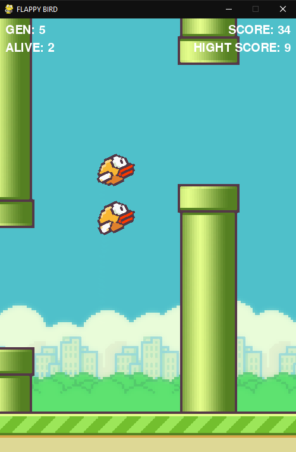
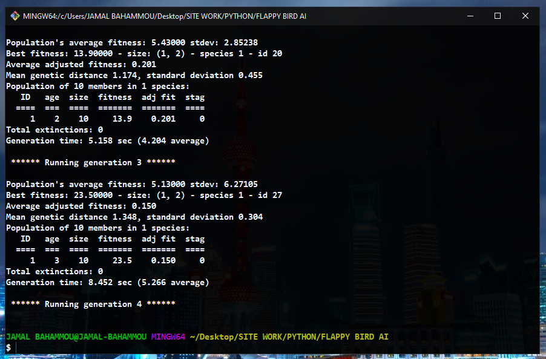

# FLAPPY_BIRD_AI





A Simple Game App made with PYTHON using the PYGAME platform, and implement the NEAT algorithm to add to the Bird the abilities to overcome obstacles.

## Getting Started

These instructions will get you a copy of the project up and running on your local machine for development and testing purposes. See deployment for notes on how to deploy the project on a live system.

### Prerequisites

You need to have [PYTHON](https://www.python.org/downloads/) and [PYGAME](https://www.pygame.org/download.shtml) install in your machine
```
pip install pygame
```
To implement the MACHINE LEARNING to the game we use [NEAT](https://neat-python.readthedocs.io/en/latest/) for PYTHON
```
pip install neat-python
```


### Installing

Clone the Repository by runing

```
git clone https://github.com/jamal-Bahammou/FLAPPY_BIRD_AI.git
```

### Lunch the game

```
python main.py
```

## Built With

- [PYTHON](https://www.python.org/)
- [PYGAME](https://www.pygame.org/)
- [NEAT](https://neat-python.readthedocs.io/en/latest/)

## Contributing

Please feel free to send pull request if you want to contribute!

## Authors

- **Jamal Bahammou** - _Computer Science Student_ - [jamal-Bahammou](https://github.com/fidalgodev)